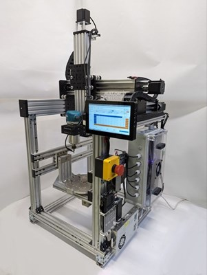
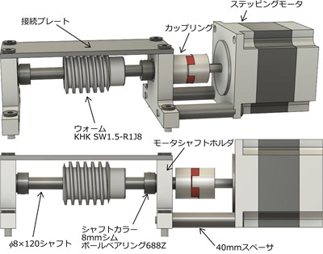
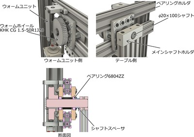
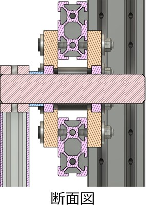
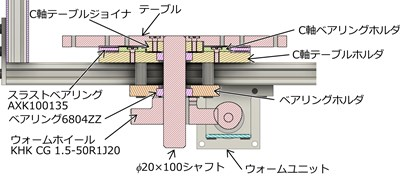
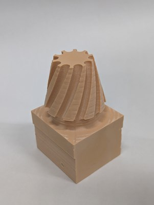
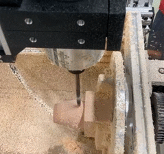

# E-moc X5
## 概要
　E-moc X5は教育用オープンソース5軸CNCマシンです。主に教育機関等で5軸加工の動きを自身の手で学ぶことを目的とし，開発した5軸加工機になります．5軸加工機の教育内容としては，金属切削の難しさや高精度の追求ではなく，5軸加工機でしか加工できない形状の理解や，CAD/CAMとの連携に関する部分です．したがって，大型・高級な高精度5軸加工機は必要なく，加工可能な材料も多岐にわたる必要はないです．  
そこで，開発したのがE-mocX5（Educational Machine of Opensource Collaboration X5）になります．この5軸加工機は加工対象物を金属ではなくケミカルウッドなどの樹脂に限定し，高精度・剛性を妥協することによって，安価な5軸加工機を開発しました．E-mocX5は直動のXYZ軸，回転のAC軸を有しており，同時5軸加工を行うことができます．また，各軸はステッピングモータで制御を行っています．オープンソースとして公開することによって，作業者自身がメンテナンス，修理できるようにし，教育機関への導入のハードルを下げ，5軸加工教育の向上をこのプロジェクトの目的としています．  

## 仕様
下図のように，工具側にX軸，Y軸，Z軸の直動軸，工作物側にA軸，C軸という軸構成になっています．
  
各軸の移動量は以下のとおりです．  
* X軸　240mm
* Y軸　295mm
* Z軸　325mm
* A軸　-90°～135°
* C軸　±360°（無限回転）

仕様を以下に示します．
* テーブルサイズ：直径200mm
* 最大ワークサイズ：縦約120mm×横約120mm×高さ約150mm
* マシンサイズ：奥行約600mm×幅600mm×高さ約1100mm
* 被削材：ケミカルウッド、スタイロフォームなど被削性が良いもの  

組み立てによって加工可能なサイズが変動します．

部品リストは[BOM](./BOM.md)を参考にしてください．

## 主要要素
### 直動機構
OPENBUILDS C-Beam Machine：Mark Carew氏の直動機構を使用しています．構造，組立方法に関しましては，下記リンクを参考にしてください．また，E-mocX5はAvalonTech社で販売しております部品を用いて直動機構を組み立ています．
* [OPENBUILDS Mark Carew氏](https://openbuilds.com/members/mark-carew.1/)
* [AvalonTechオンラインストア](https://avalontech.jp/shop/)
* [AvalonTech組み立てドキュメント](https://docs.avalontech.jp/)

### 回転機構
#### ウォームユニット
A軸，C軸共にウォームギア駆動になります．また，ウォームユニットの構造はA軸C軸共通になっています．  

#### A軸
A軸周辺（A軸モータがあり）の概略図を下記に示します．ウォームホイールを取り付けた軸にウォームユニットを接続し，駆動させます．ウォームホイールの逆側はメインシャフトホルダを通じてクレードルに接続されます．  
  
モータがない側のA軸周辺の概略図を下記に示します．構造はモータがある側とおなじで，違いはウォームホイールの有無になります．  

#### C軸
C軸周辺の概略図を下記に示します．基本的にはA軸と同様な構造で駆動させています．ただ，A軸ではクレードルに接続していた部分がC軸ではテーブルに変更になるため，C軸の専用部品がいくつか追加されています．  

### 主軸
主軸には[マキタ製RT0700C](https://avalontech.jp/product/fa01/)を使用しています．AC100Vで動作するため，使い勝手が良いためです．また，[工具固定台座](https://avalontech.jp/product/bd02/)に取り付けて使用しています．E-mocX5では剛性の向上，主軸を垂直に固定する狙いで，この工具固定台座を2つ使用しています．もちろん，1つのみの使用でも問題ありません．

### 制御ボード
各軸の駆動にはNEMA23ステッピングモーターを6台使用しており，制御基板は[Duet3 MainBoard 6HC](https://docs.duet3d.com/Duet3D_hardware/Duet_3_family/Duet_3_Mainboard_6HC_Hardware_Overview)　1台でE-mocX5をコントロールをコントロールしています．  
また，上記のE-mocX5の全体写真では，タッチディスプレイやRaspberry Pi4を使用してDuet3 MainBoard 6HCと接続し，コントロールを行っています．今回の全体写真に写っている構成（HDMIケーブル等）はBOMのオプション部分に記載しています．もちろん，Raspberry Piでなく，ノートPCなどで接続することもできます．Duet3 MainBoard 6HCの使用方法に関しては，[Duet3D社のドキュメント](https://docs.duet3d.com/Duet3D_hardware/Duet_3_family/Duet_3_Mainboard_6HC_Hardware_Overview)や[AvalonTech社のドキュメント](https://docs.avalontech.jp/)を参考にしてください．  
Duet3 MainBoard 6HCの制御に必要なconfig.gファイルなどは，Duet3 MainBoard 6HCフォルダに保存されています．リミットスイッチ，モータの接続ポートなどはconfig.gファイルを参考にしてください．

### リミットスイッチ
各軸にリミットスイッチを取り付ける必要があります．XYZA軸は+側の端に取り付けます．各軸ともスイッチをアルミフレームに取り付け，XYZはガントリープレート，A軸はクレードルの支柱のアルミフレームでスイッチを押すことになります．C軸は任意の場所に取り付けます．C軸はリミットスイッチをアルミフレームに取り付けます．テーブルのネジ穴を使用して，スペーサやネジを取り付け，そのスペーサなどでスイッチを押します．

## 回転軸原点自動補正機能
上述した通り，E-mocX5はリミットスイッチを使用して原点位置の特定を行っています．直動軸に関してはあまり大きな問題にならないのですが，A軸C軸の回転軸に関してはリミットスイッチの取り付け誤差や何度もスイッチを使用することによって，ズレが生じ，大きな問題になります．例えば，A軸であればリミットスイッチが押された場所がA90°の位置と認識し，A0°の位置を逆算します．もし誤差がある場合はA0°に移動してもテーブルが水平になりません．これを解決するために，回転軸には原点自動補正機能を準備しています．  

以下に動作させる前の準備を示します．
* 通電する工具を主軸に取り付ける．
* 導線を2本準備し，1本には片側に鰐口クリップ，もう1本は片側にY型の圧着端子をつける．
* 工具に鰐口クリップを取り付ける．
* Y型圧着端子をA軸のベアリングホルダ取り付けナットに共締めする．
* 2本の導線をリミットスイッチの配線のようにコネクタに取り付け，Duetに接続する．
* 工具をテーブルに接触させたときに通電していることを確認する．  

これらの準備ができた場合，bed.gを実行します．実行するとテーブル，C軸キャリブレーションジグに工具が接触し，A軸，C軸のキャリブレーションを行います．詳しい内容はbed.gを参考にしてください．

## 加工例
### インペラ
同時5軸加工でインペラを削り出しました．  
サイズ：直径100mm，高さ70mm  
被削材：ケミカルウッド  
使用工具：粗加工　[Φ6mm4枚刃スクエアエンドミル](https://avalontech.jp/product/fa11/)  
　　　　　仕上げ加工　[Φ6mm2枚刃超硬ボールエンドミル](https://www.monotaro.com/p/6338/7914/)  
送り速度：500mm/min  
加工時間：約3時間  
加工の様子  

### スパイラルベベルギア
スパイラルベベルギアを模した形状の削り出しを行いました．
被削材：ケミカルウッド  
使用工具：[Φ6mm2枚刃超硬ボールエンドミル](https://www.monotaro.com/p/6338/7914/)  
送り速度：500mm/min  
加工結果  
  
加工の様子  

## ライセンス
[CC BY 4.0](https://creativecommons.org/licenses/by/4.0/)  

## 免責事項
E-mocX5を製作，使用したことによって生じたすべての障害・損害・不具合等に関しては， 私と私の関係者および私の所属するいかなる団体・組織とも，一切の責任を負いません．各自の責任においてご使用ください．

## Author
[ryotakito](https://www.kobe-kosen.ac.jp/department/staff/kikai/kitou.html)  
[HRMK](https://x.com/HRMK_KCCT?t=Fr6PaqYAp8kexe8a00zGTQ&s=09)

## 今後に関して
現在より組み立てが簡単で，組み立て精度を出しやすいVer2を開発中です．また，組み立てマニュアルなどに関しましても，Ver2と同時に公開する予定です．少々お待ち下さい．

## 謝辞
E-mocX5はAvalonTech株式会社からの奨学寄附金にて遂行しております．この場を借りて感謝申し上げます．
また，卒業研究を通じてE-mocX5に関わった全ての皆様に感謝申し上げます．