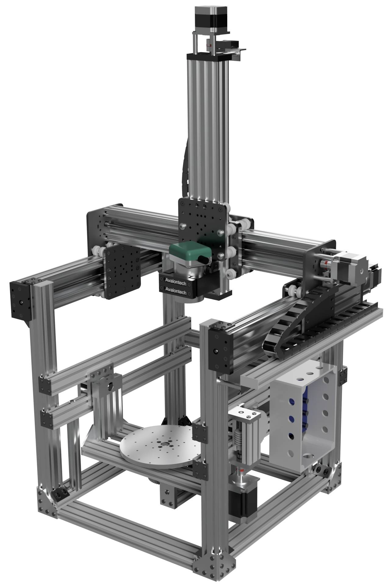
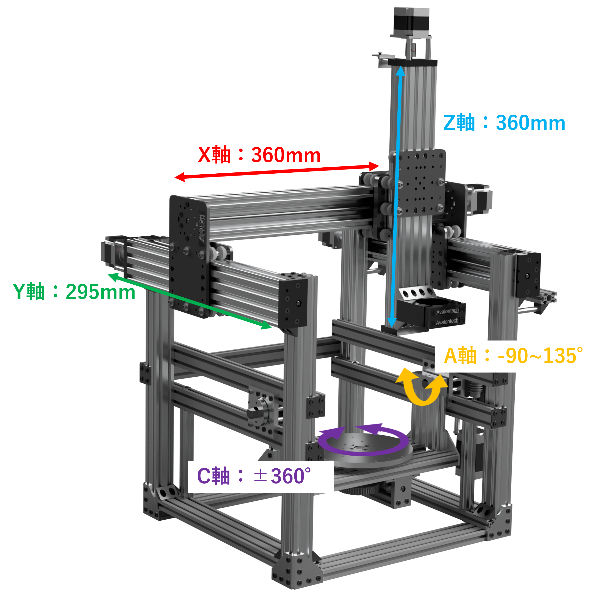
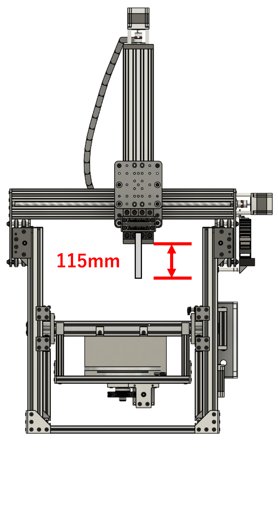
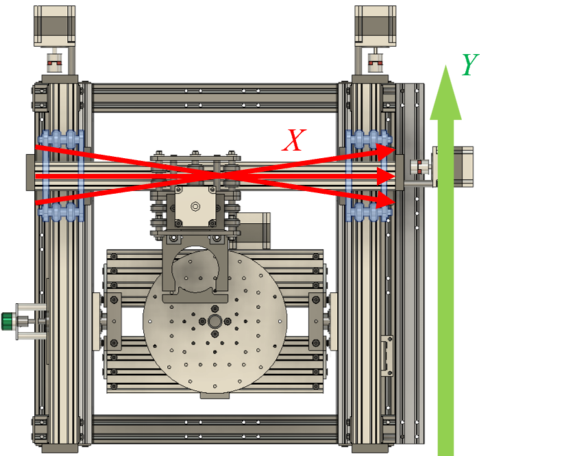

# E-moc X5
## 概要
　E-moc X5は教育用オープンソース5軸CNCマシンです。主に教育機関等で5軸加工の動きを自身の手で学ぶことを目的とし，開発した5軸加工機になります．5軸加工機の教育内容としては，金属切削の難しさや高精度の追求ではなく，5軸加工機でしか加工できない形状の理解や，CAD/CAMとの連携に関する部分です．したがって，大型・高級な高精度5軸加工機は必要なく，加工可能な材料も多岐にわたる必要はありません．  
そこで，開発したのがE-mocX5（Educational Machine of Opensource Collaboration X5）になります．この5軸加工機は加工対象物を金属ではなくケミカルウッドなどの樹脂に限定し，高精度・剛性を妥協することによって，安価な5軸加工機を開発しました．E-mocX5は直動のXYZ軸，回転のAC軸を有しており，同時5軸加工を行うことができます．また，各軸はステッピングモータで制御を行っています．オープンソースとして公開することによって，作業者自身がメンテナンス，修理できるようにし，教育機関への導入のハードルを下げ，5軸加工教育の向上をこのプロジェクトの目的としています．  


## 仕様
下図のように，工具側にX軸，Y軸，Z軸の直動軸，工作物側にA軸，C軸という軸構成になっています．
  
各軸の移動量は以下のとおりです．  
* X軸　360mm
* Y軸　295mm
* Z軸　295mm
* A軸　-90°～135°
* C軸　±360°（無限回転）

仕様を以下に示します．
* 全体サイズ：幅約700mm×奥行最大約710mm×高さ最大約1120mm
* 設置面サイズ：約500mm×約500mm
* 最大ワークサイズ：Φ289mm，高さ295mm
* 被削材：ケミカルウッド◎，ポリカーボネート○，A2014×
* 主軸回転数：（マキタ製トリマRT0700C使用時）10000~30000rpm
* 取付部シャンク径：（RT0700C使用時）Φ6mm，Φ8mm
* 直線軸駆動部：C-Beam（V-Slotアルミフレーム）＆ポリカーボネート製ホイール+NEMA23ステッピングモータ
* 回転軸駆動部：小原歯車工業製SWウォームギア（S45C）＆CGウォームホイール（FC200）+NEMA23ステッピングモータ
* 制御基板：Duet3 MainBoard 6HC
* 制御方法：PC等をLANケーブルで接続しwebブラウザから指令
* 電源：AC100V

組み立てによって加工可能なサイズが変動します．  
部品リストは[BOM](./BOM.md)を参考にしてください．また，各種部品の図面は[drawing](./drawing/)をご覧ください．

## 主要要素
### 直動機構
OPENBUILDS C-Beam Machine：Mark Carew氏の直動機構を使用しています．構造は下記リンクを参考にしてください．
* [OPENBUILDS Mark Carew氏](https://openbuilds.com/members/mark-carew.1/)
* [AvalonTechオンラインストア](https://avalontech.jp/shop/)
* [AvalonTech組み立てドキュメント](https://docs.avalontech.jp/)

### 回転機構
A軸，C軸は共にウォームギア駆動になります．また，ウォームユニットの構造はA軸C軸共通になっています．  

### 主軸
主軸には[マキタ製RT0700C](https://avalontech.jp/product/fa01/)を使用しています．AC100Vで動作し，使い勝手が良いためです．また，[工具固定座](https://avalontech.jp/product/bd02/)に取り付けて使用しています．E-mocX5では剛性の向上，主軸を垂直に固定する狙いで，この工具固定台座を2つ使用しています．もちろん，1つのみの使用でも問題ありません．

### 制御ボード
各軸の駆動にはNEMA23ステッピングモーターを6台使用しており，制御基板は[Duet3 MainBoard 6HC](https://docs.duet3d.com/Duet3D_hardware/Duet_3_family/Duet_3_Mainboard_6HC_Hardware_Overview)　1台でE-mocX5をコントロールをコントロールしています．  
Duet3 MainBoard 6HCの使用方法に関しては，[Duet3D社のドキュメント](https://docs.duet3d.com/Duet3D_hardware/Duet_3_family/Duet_3_Mainboard_6HC_Hardware_Overview)や[AvalonTech社のドキュメント](https://docs.avalontech.jp/)を参考にしてください．  
Duet3 MainBoard 6HCの制御に必要なconfig.gファイルなどは，Duet3 MainBoard 6HCフォルダに保存されています．リミットスイッチ，モータの接続ポートなどはconfig.gファイルを参考にしてください．

### リミットスイッチ
各軸にリミットスイッチを取り付ける必要があります．A軸は+側の端，C軸は0°付近に取り付けます．各軸ともスイッチをアルミフレームに取り付け，A軸はクレードルの支柱のアルミフレームでスイッチを押すことになります．C軸はC軸テーブルを無限回転させる必要があるため，新形状の板バネがないリミットスイッチをC軸テーブルに取り付けたベアリングで押すことになります．
詳細は組立説明の[1. クレードルASSY](./組立説明/1.%20クレードルASSY.md)ならびに[9. 配線系＆その他](./組立説明/9.%20配線系＆その他.md)を参考にしてください．

## 回転軸原点自動補正機能
上述した通り，E-mocX5はリミットスイッチを使用して原点位置の特定を行っています．直動軸に関してはあまり大きな問題にならないのですが，A軸C軸の回転軸に関してはリミットスイッチの取り付け誤差や何度もスイッチを使用することによって，ズレが生じ，大きな問題になります．例えば，A軸であればリミットスイッチが押された場所がA90°の位置と認識し，A0°の位置を逆算します．もし誤差がある場合はA0°に移動してもテーブルが水平になりません．これを解決するために，回転軸には原点自動補正機能を準備しています．  

以下に動作させる前の準備を示します．
* 通電する工具を主軸に取り付ける．
ただしツールの突き出し長さはZ軸C-Beamリードスクリュー固定座下面から115mm以内であること
  
(突き出し長さが115mm以上の場合，C軸原点の補正時にクレードル（A軸）を-90°に移動させた際，C軸テーブルのプローブポイントよりもエンドミルの先端が下側となり干渉するため)
* 導線を2本準備し，1本には片側に鰐口クリップ，もう1本は片側にY型の圧着端子をつける．
* 工具に鰐口クリップを取り付ける．
* Y型圧着端子をA軸のベアリングホルダ取り付けナットに共締めする．
* 2本の導線をリミットスイッチの配線のようにコネクタに取り付け，Duetに接続する．
* 工具をテーブルに接触させたときに通電していることを確認する．  

これらの準備ができた場合，bed.gを実行します．実行するとテーブル，C軸キャリブレーションジグに工具が接触し，A軸，C軸のキャリブレーションを行います．詳しい内容はbed.gならびに[9. 配線系＆その他](./組立説明/9.%20配線系＆その他.md)を参照してください．

## センサレスホーミング
回転軸原点自動補正機能を実行する際に，機械原点を使用してマシンの制御を行います．しかし，起動時の機械原点を決定するために使用していたリミットスイッチでは，組み立て方によって取り付け位置が大きくずれる可能性があるため，オープンソース化を行うにあたって大きな障壁となっていました．
また，E-moc X5ではY軸の駆動ユニットが2つある構造となっているため，補正機能と同様の理由により左右のY軸で異なる位置に原点が設定される可能性がありました．
  
そこで，3Dプリンタなどで採用例がある，センサレスホーミングをE-moc X5のX,Y,Z軸に導入することにしました．
直動軸の可動部品を移動範囲端の構造部材に意図的に衝突させ，ステッピングモータの電流変化を制御基板で検知することで機械原点を設定します．
詳細は[Duet3D社のドキュメント](https://docs.duet3d.com/en/User_manual/Connecting_hardware/Sensors_stall_detection)とDuet3 MainBoard 6HCのsysフォルダを参考にしてください．

## NCプログラム
E-mocX5の制御に使用しているDuet3Dは工具先端点制御（TCP制御）に対応していません．よって，NCプログラムを作成する段階で，意図する移動を細かく指示する必要があります．また，CAMで指示するワーク座標系の原点とE-mocX5上で指示するワーク座標系の原点が一致していなければなりません．よって，大きいワークを用意し，周りを削ることで原点位置を一致させました．  
私達がこれまで加工した工作物はメインプロセッサとして市販のCAMソフトウェアを使用し，CLデータを生成し，ポストプロセッサは自作したものを使用していました．メインプロセッサの処理を行うと，工具位置$\mathbf{P}=（P_x，P_y，P_z）$と工具軸ベクトル$\overrightarrow{T}=（T_x，T_y，T_z）$が生成されます．これを下記の計算式をに当てはめ，各軸の移動量を計算します．  
```math
\begin{align}
&A=\frac{180}{\pi}\cos^{-1}(T_z) \\
&C = \left\{
\begin{array}{ll}
\frac{180}{\pi}\mathrm{sgn}(T_y)\cos^{-1}(\frac{T_y}{\sqrt{T_x^2，T_y^2}}) & (T_z \neq 1)\\
arbitrary & (T_z = 1)
\end{array}
\right.\\
&\mathrm{sgn}(a) = \left\{
\begin{array}{ll}
1 & (a \geqq 0)\\
-1 & (a < 0)
\end{array}
\right.\\
&X=\frac{(SC\times P_y+CC\times P_x)}{(SC^2+CC^2)}\\  
&Y=-\frac{-(SA\times SC^2\times P_z)-CC^2\times SA\times P_z-CA\times CC\times P_y+CA\times SC\times P_x+(SA\times SC^2+CC^2\times SA)\times az}{(SA^2+CA^2)\times SC^2+CC^2\times SA^2+CA^2\times CC^2}\\  
&Z=\frac{CA\times SC^2\times P_z+CA\times CC^2\times P_z-CC\times SA\times P_y+SA\times SC\times P_x+((SA^2+CA^2-CA)\times SC^2+CC^2\times SA^2+(CA^2-CA)\times CC^2)\times az}{((SA^2+CA^2)\times SC^2+CC^2\times SA^2+CA^2\times CC^2}\\  
\end{align}
```
ここで，$SA=\sin(A)$，$SC=\sin(C)$，$CA=\cos(A)$，$CC=\cos(C)$，$az$はA軸回転軸中心とテーブルまでの距離100mmです．また，C軸の回転量は-180°から180°で計算されますが，実際にモータを制御するDuet3Dは回転角度を判断することができません．具体的にいうと，－180°=180°を判断できず，-180°の位置で180°へ司令すると，360°回転して元の位置に戻ります．言わば直動軸と同じような動作をします．よって，1つ前の角度を確認し数値を調整する必要があります．  

## ライセンス
[CC BY 4.0](https://creativecommons.org/licenses/by/4.0/)  


## 免責事項
E-mocX5を製作，使用したことによって生じたすべての障害・損害・不具合等に関しては， 私と私の関係者および私の所属するいかなる団体・組織とも，一切の責任を負いません．各自の責任においてご使用ください．

## Author
[ryotakito](https://www.kobe-kosen.ac.jp/department/staff/kikai/kitou.html)  
[HRMK](https://x.com/HRMK_KCCT?t=Fr6PaqYAp8kexe8a00zGTQ&s=09)

## 謝辞
E-mocX5はAvalonTech株式会社からの奨学寄附金にて遂行しております．この場を借りて感謝申し上げます．
また，卒業研究を通じてE-mocX5に関わった全ての皆様に感謝申し上げます．
